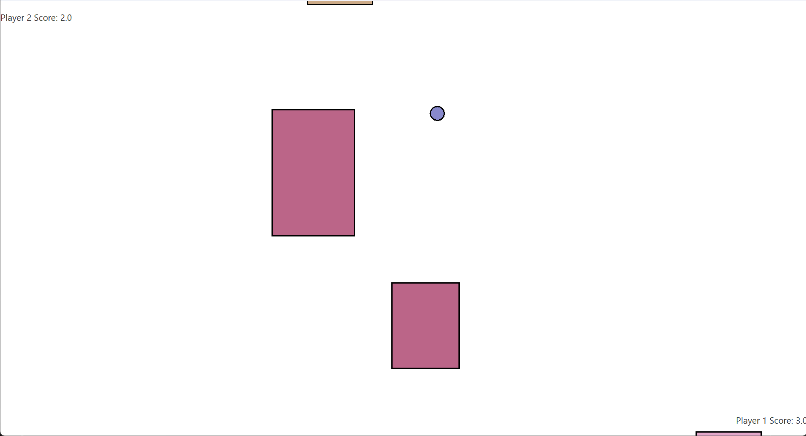
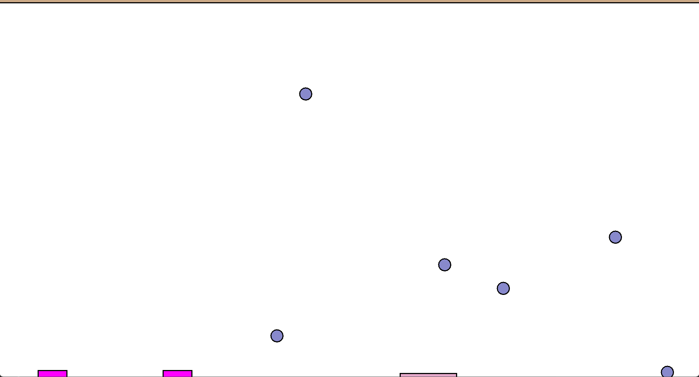
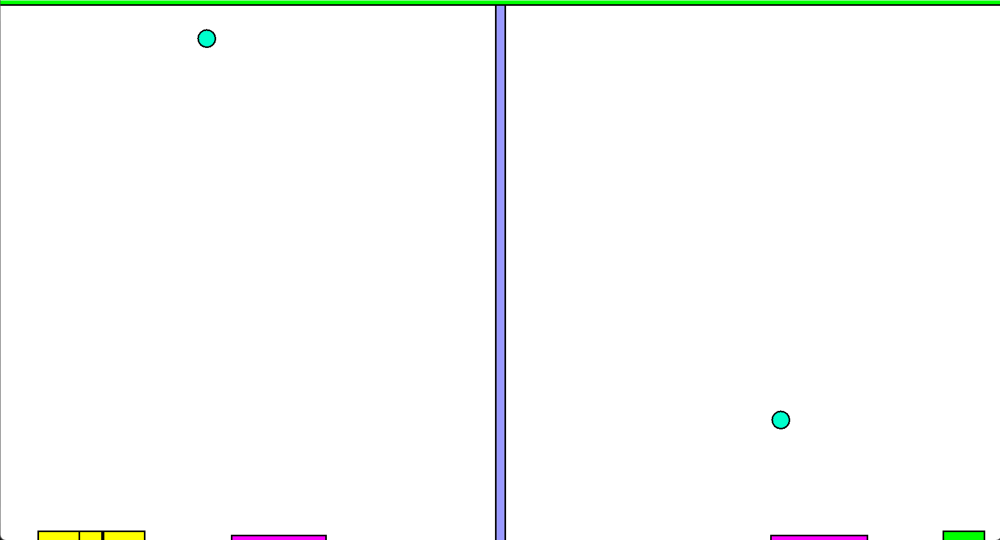

# iika's Pong
A semi-modern Pong game written in Kotlin.

## Description
This game is a side project that I also uploaded as Project #1 for my APCS Portfolio.
This is also my first time writing Kotlin programs as well as developing a game in general.

## Usage
1. Download the `.jar` file
2. Download Java
3. Double-click the file OR run `java -jar path\to\Pong.jar` in a command line.

## Features
I tried to include every feature that I could think of to keep the game replayable and make it not that boring.
- 3 Game Modes
- 3 (or infinitely many) Game Maps
- 5 Toggleable Power Ups
- 3 Special Modifiers
- Customizable Colors
- Customizable Keybinds
- Local Multiplayer

## Goals
Goals I want to implement in the future. (NOT CONFIRMED)
- More Power Ups
- More Maps
- Refactor code to be better (I'm just a beginner)
- Online multiplayer (I need to learn networking)

## Screenshots

## Contact
Created by [**iika**](https://github.com/iika-a/) 
Discord: iika 
Feel free to contact me!